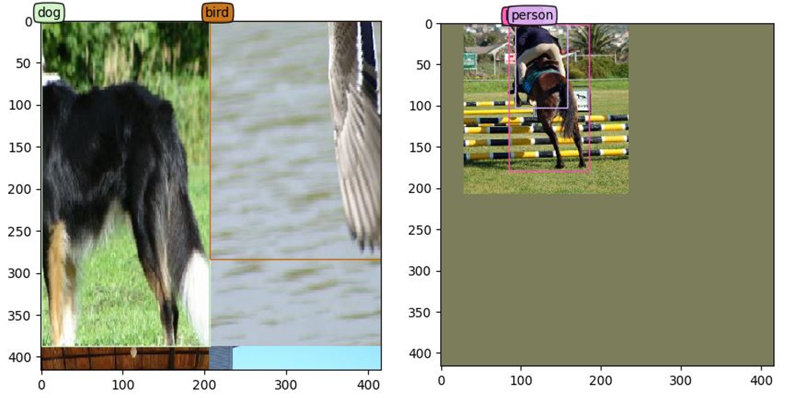

# Object Detection Dataset Pytorch 

### data type

- [x] VOC
- [x] COCO
- [ ] IMAGENET

### data augmentation 

- [x] Resize
- [x] Zoom In
- [x] Zoom Out 
- [x] Photometric Distort
- [x] Horizontal Flip
- [x] Mosiac

- flip / resize / distortion

- zoom in / out

- mosaic

